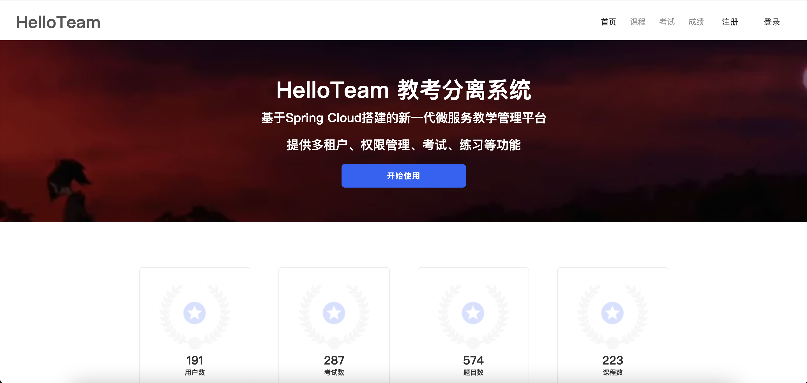
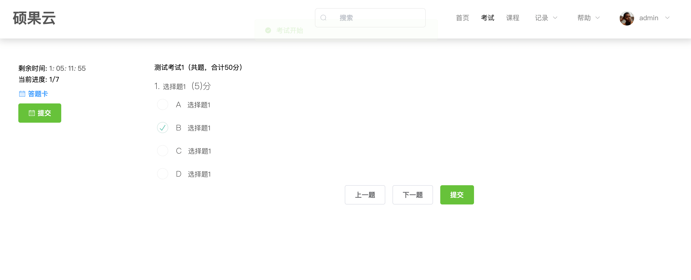

<h1 align="center">Welcome to HelloTeam Exam System 👋</h1>

  
  
  

> HelloTeam，基于Spring Cloud搭建的新一代微服务教学管理平台，提供多租户、权限管理、在线考试、练习等功能
>
> 题型支持单选题、多选题、不定项选择题、判断题、简答题
>
> 支持PC、H5

### 🏠 [主页](https://github.com/Breeze-P/ExamSystem)

### ✨ [在线体验-前台](http://two.404forever.com/#/home)

### ✨ [在线体验-后台](http://two.404forever.com/#/home:81)

测试账号：

|   单位ID   |      账号      |   密码   |   角色    |
| --------- | -------- | -------- | -------- |
|  gitee  |  preview  | 123456  |  预览权限|
|  gitee  |  student  | 123456  |  学生  |
|  gitee  |  teacher  | 123456  |  老师  |

## 技术选型

- 服务注册与发现：`Consul`
- 熔断器：`Hystrix` + `Turbine`
- 客户端负载均衡：`Ribbon`
- 内部服务调用：`Feign`
- 网关：`Spring Cloud Gateway`
- 认证鉴权：`Spring Cloud OAuth2` + `JWT`
- 程序监控：`Spring Boot Admin` / `Spring Boot Actuator`
- 分布式配置中心：`Spring Cloud Config`
- 分布式调用链监控：`Spring Cloud Sleuth` + `Zipkin`
- 数据库：`MySQL 5.7`
- 部署：`Docker` + `docker-compose`
- 构建工具：`Maven`
- 后台 API 文档：`Swagger`
- 消息队列：`RabbitMQ`
- 文件系统：`本地目录`、`七牛云`、`FastDfs`
- 缓存：`Redis`
- 前端：`vue`
- 小程序：`wepy`

## 核心依赖

|      名称      |   版本    |
| --------- | -------- |
| `Spring Boot`    | `2.2.5.RELEASE`  |
| `Spring Cloud`   | `Hoxton.SR3`  |

## 系统架构

## 功能概述

项目分前台网站和后台管理两部分，前台主要提供考试功能，后台提供基础管理、考试管理功能。

前台主要提供在线考试、在线学习功能

后台管理分为：首页监控、系统管理、系统监控、考务管理、附件管理、个人管理

首页监控：提供系统租户数、用户数、考试数、近七天考试记录数等监控

系统管理：提供用户、部门、角色、权限等基础管理
- 用户管理：用户信息增删改查、导入导出
- 部门管理：部门信息增删改查
- 角色管理：角色信息增删改查、分配权限
- 菜单管理：菜单信息增删改查、导入导出
- 终端管理：管理OAuth2.0的客户端，如client_id、client_secret、access_token有效时间等
- 路由管理：网关路由管理，包括路由的增删改查、刷新路由等

系统监控：监控服务、日志等
- 日志监控：查看系统日志
- `consul`监控：`consul`服务监控
- `zipkin`监控：监控服务的调用链路
- 服务监控：`spring boot admin`服务监控
- 接口文档：`swagger api`文档

考务管理：提供课程、考试、题库、成绩等管理
- 课程管理：课程信息增删改查
- 考试管理：考试信息增删改查、题目管理、发布回收，题目管理支持简单文本、富文本输入、从题库添加等，题型支持单选题、多选题、不定项选择题、判断题、简答题，生成二维码分享
- 题库管理：题目分类增删改查、题目信息增删改查，题型支持单选题、多选题、不定项选择题、判断题、简答题
- 成绩管理：查看成绩、成绩批改、导出等功能
- 知识库：知识库增删改查、上传附件

附件管理：项目的所有附件存储在`fastDfs`里，提供统一的管理入口
- 附件列表：管理所有附件，如用户头像、考试附件、知识库附件等，存储方式支持服务器本地目录、`fastDfs`，七牛云

个人管理：管理个人资料和修改密码
- 个人资料：姓名、头像等基本信息的修改
- 修改密码：修改密码

## 系统截图

### 前台功能（点击查看大图）

<table>
	<tr>
	    <td></td>
        <td></td>
    </tr>
    <tr>
        <td></td>
        <td></td>
    </tr>
    <tr>
        <td></td>
        <td></td>
    </tr>
    <tr>
        <td></td>
        <td></td>
    </tr>
</table>

### 后台功能（点击查看大图）

<table>
	<tr>
        <td></td>
        <td></td>
    </tr>
    <tr>
        <td></td>
        <td></td>
    </tr>
    <tr>
        <td></td>
        <td></td>
    </tr>
    <tr>
        <td></td>
        <td></td>
    </tr>
    <tr>
        <td></td>
        <td></td>
    </tr>
    <tr>
        <td></td>
        <td></td>
    </tr>
</table>

### 系统监控（点击查看大图）

<table>
	<tr>
        <td></td>
        <td></td>
    </tr>
    <tr>
        <td></td>
        <td></td>
    </tr>
    <tr>
        <td></td>
        <td></td>
    </tr>
</table>

## 部署文档

- [后端部署](docs/deploy/HelloTeam考试系统-本地部署（后端）.pdf)

- [前端部署](docs/deploy/HelloTeam考试系统-本地部署教程（前端）.pdf)

## 作者

👤 **HelloTeam**

* Github: [Breeze_P](https://github.com/Breeze-P)

* Github: [ZzZ](https://github.com/zZay132-4ONE)
